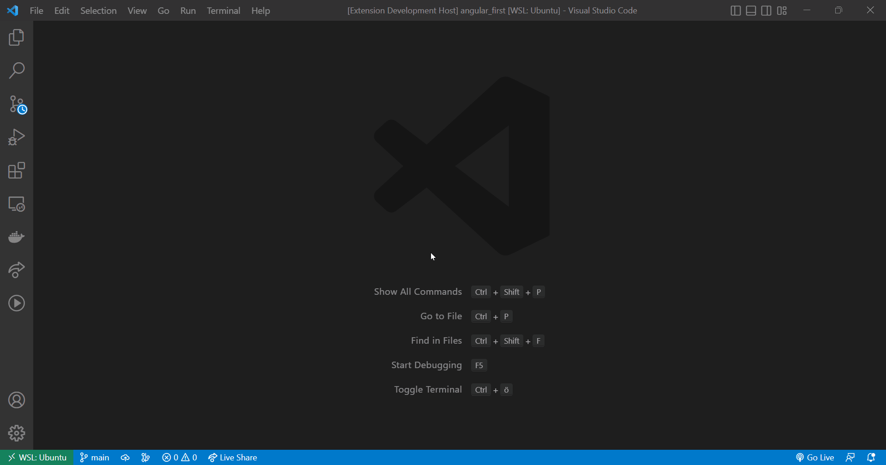

# Palette Search
A VSCode extension what lets you start searching the internet in the command palette.

# Contribute?

1. Clone Repo
2. Run <code>npm install</code>
3. Finished with your part? Push to new branch and open a PR.